<div align="center">

# 🕴️ S Y N D I C A T E &nbsp; S U I T S
### **1990s Cartoon Noir Bespoke Mafia Tailoring Atelier & Real-Time AI Consigliere**
*444 Mulberry Street, Little Italy • Est. 1928 — "Dress for the verdict you want."*

<p align="center">
  <a href="https://nextjs.org/"></a>
  <a href="https://react.dev/"></a>
  <a href="https://www.typescriptlang.org/"></a>
  <a href="https://tailwindcss.com/"></a>
  <a href="https://threejs.org/"></a>
</p>
<p align="center">
  <a href="https://openrouter.ai/"></a>
  <a href="https://sdk.vercel.ai/"></a>
  <a href="#-voice--lip-sync-pipeline"></a>
  <a href="LICENSE"></a>
</p>

<br />

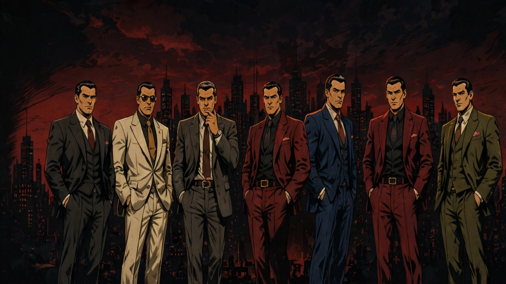

<br />

> *"Fuggedaboutit! Look at you walking around in off-the-rack like a two-bit street punk. I'm **Toni Lee**—Master Tailor & Consigliere to the Five Families for over 30 years. Tell Toni what kind of sit-down you're stepping into, and I'll get you fitted in pure syndicate gold."*

</div>

---

## 🧭 Table of Contents

- [🎬 Live Video Previews & Motion Showcase](#-live-video-previews--motion-showcase)
- [🔥 What Makes Syndicate Suits Different](#-what-makes-syndicate-suits-different)
- [🧠 System Architecture (OpenRouter Nemotron + Edge TTS + R3F)](#-system-architecture-openrouter-nemotron--edge-tts--r3f)
- [🎙️ Meet Toni Lee — Real-Time AI Consigliere](#️-meet-toni-lee--real-time-ai-consigliere)
- [👔 The Syndicate Seven — Complete Vault & Archetype Gallery](#-the-syndicate-seven--complete-vault--archetype-gallery)
- [🏛️ The Syndicate Code — Four Pillars of Craftsmanship](#️-the-syndicate-code--four-pillars-of-craftsmanship)
- [⚡ 13 Autonomous DOM Tools & Generative UI Cards](#-13-autonomous-dom-tools--generative-ui-cards)
- [🔑 Secret Underworld Family Passcodes](#-secret-underworld-family-passcodes)
- [🎨 1990s Cartoon Noir Design System](#-1990s-cartoon-noir-design-system)
- [📂 Project Directory Structure](#-project-directory-structure)
- [🚀 Quick Start & Vercel Deployment](#-quick-start--vercel-deployment)

---

## 🎬 Live Video Previews & Motion Showcase

Experience the cinematic motion layers built directly into the repository:

<div align="center">

<table>
  <tr>
    <td align="center" width="50%">
      <h3>🎥 1. The Atelier Cinematic Hero Reel</h3>
      <a href="https://raw.githubusercontent.com/Bala0o8o0/Syndicate-Suits/main/public/hero.mp4">
        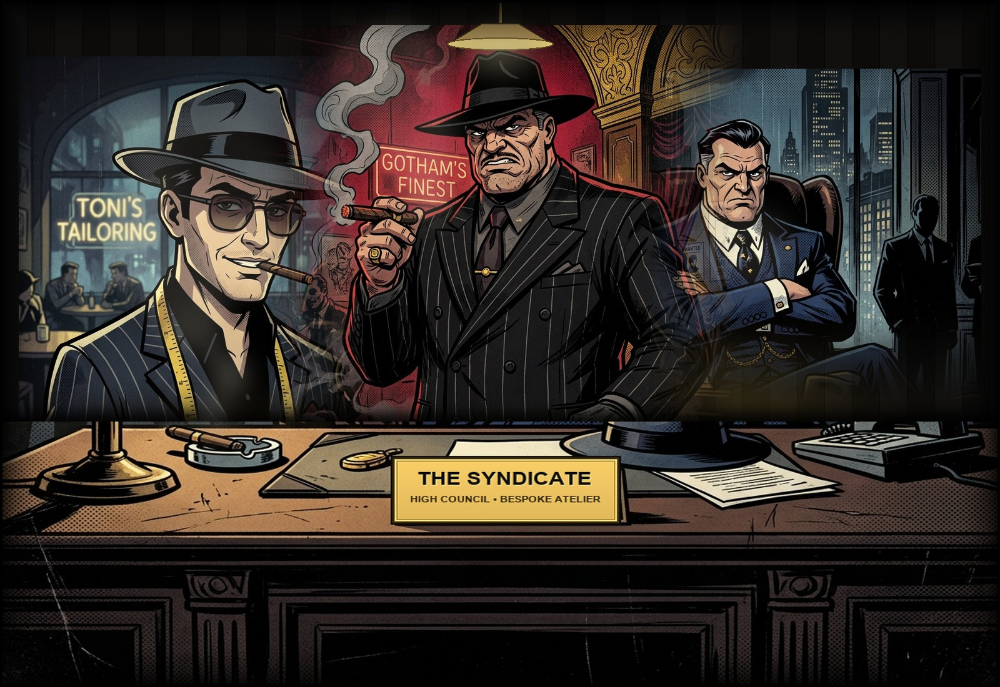
      </a>
      <p>
        <a href="https://raw.githubusercontent.com/Bala0o8o0/Syndicate-Suits/main/public/hero.mp4">
          
        </a>
      </p>
      <sub>40-frame scroll-scrubbed HTML5 canvas sequence + full-bleed noir motion video (<code>public/hero.mp4</code>)</sub>
    </td>
    <td align="center" width="50%">
      <h3>🎙️ 2. Toni Lee Live Talking Avatar</h3>
      <a href="https://raw.githubusercontent.com/Bala0o8o0/Syndicate-Suits/main/public/videos/toni-lee-talking.mp4">
        
      </a>
      <p>
        <a href="https://raw.githubusercontent.com/Bala0o8o0/Syndicate-Suits/main/public/videos/toni-lee-talking.mp4">
          
        </a>
      </p>
      <sub>Audio-reactive dual-layer video avatar synchronized with Web Audio API lip-sync (<code>public/videos/toni-lee-talking.mp4</code>)</sub>
    </td>
  </tr>
</table>

</div>

<details>
<summary><b>📺 Click to Expand Inline HTML5 Video Players</b></summary>
<br />
<div align="center">
  <video src="https://raw.githubusercontent.com/Bala0o8o0/Syndicate-Suits/main/public/hero.mp4" controls muted loop width="85%"></video>
  <br /><br />
  <video src="https://raw.githubusercontent.com/Bala0o8o0/Syndicate-Suits/main/public/videos/toni-lee-talking.mp4" controls loop width="55%"></video>
</div>
</details>

---

## 🔥 What Makes Syndicate Suits Different

| Capability | Technical Highlights |
| :--- | :--- |
| 🧠 **NVIDIA Nemotron 3 Ultra Brain** | Powered by **`nvidia/nemotron-3-ultra-550b-a55b:free`** via **OpenRouter** + **Vercel AI SDK (`streamText`)** for ultra-fast token streaming, Generative UI cards, and zero-key local fallback. |
| 🎙️ **Bidirectional Mobster Voice AI** | Hands-free microphone input (`webkitSpeechRecognition`) paired with server-streamed **Microsoft Edge Neural TTS** (`en-US-ChristopherNeural` at `+12%` mobster cadence). |
| 👄 **Real-Time Web Audio Lip-Sync** | Custom `AudioLipSyncAnalyser` (`AnalyserNode` FFT frequency analyzer) measures instantaneous vocal energy to drive Toni Lee's video state, mouth metrics, and gold equalizer bars. |
| 🃏 **In-Chat Generative UI Cards** | Asking Toni to recommend a suit or open your cart renders interactive **Bespoke Dossier Cards**, **Live Briefcase Mini-Inspectors**, and **20% OFF VIP Cipher Tickets** directly inside the chat stream. |
| 🕴️ **40-Frame Scroll-Scrubbed Hero** | GSAP + HTML5 `<canvas>` sequence (`ezgif-frame-001.png` → `040.png`) with dynamic fedora watermark parallax and speakeasy volumetric smoke (`smoke-canvas.tsx`). |
| 🎠 **3D WebGL Revolving Suit Stage** | Interactive Three.js / React Three Fiber 3D carousel (`character-3d-canvas.tsx`) and full-screen **3D Bespoke Customizer** (`/customizer`) with live fabric, lapel, and silk lining swaps. |
| 💼 **The Black Ledger Briefcase** | Persistent Zustand cart (`useBriefcaseStore`) supporting composite bespoke configurations, secret underworld discount passcodes, and gold-and-crimson celebratory confetti bursts. |

---

## 🧠 System Architecture (OpenRouter Nemotron + Edge TTS + R3F)

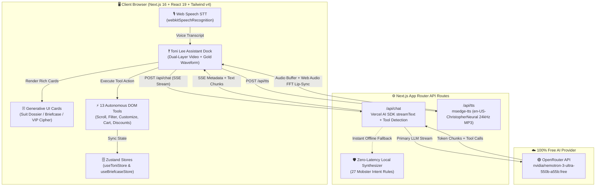
```mermaid
flowchart TB
    subgraph Client["🖥️ Client Browser (Next.js 16 + React 19 + Tailwind v4)"]
        Mic["🎙️ Web Speech STT<br/>(webkitSpeechRecognition)"]
        Widget["🕴️ Toni Lee Assistant Dock<br/>(Dual-Layer Video + Gold Waveform)"]
        GenUI["🃏 Generative UI Cards<br/>(Suit Dossier / Briefcase / VIP Cipher)"]
        DOM["⚡ 13 Autonomous DOM Tools<br/>(Scroll, Filter, Customize, Cart, Discounts)"]
        Store["🗄️ Zustand Stores<br/>(useToniStore & useBriefcaseStore)"]
    end

    subgraph Server["⚙️ Next.js App Router API Routes"]
        ChatAPI["/api/chat<br/>Vercel AI SDK streamText + Tool Detection"]
        TTSAPI["/api/tts<br/>msedge-tts (en-US-ChristopherNeural 24kHz MP3)"]
        LocalFallback["🛡️ Zero-Latency Local Synthesizer<br/>(27 Mobster Intent Rules)"]
    end

    subgraph Cloud["☁️ 100% Free AI Provider"]
        OpenRouter["🟢 OpenRouter API<br/>nvidia/nemotron-3-ultra-550b-a55b:free"]
    end

    Mic -->|"Voice Transcript"| Widget
    Widget -->|"POST /api/chat (SSE Stream)"| ChatAPI
    ChatAPI -->|"Primary LLM Stream"| OpenRouter
    ChatAPI -.->|"Instant Offline Fallback"| LocalFallback
    OpenRouter -->|"Token Chunks + Tool Calls"| ChatAPI
    ChatAPI -->|"SSE Metadata + Text Chunks"| Widget
    Widget -->|"Render Rich Cards"| GenUI
    Widget -->|"Execute Tool Action"| DOM
    DOM -->|"Sync State"| Store
    Widget -->|"POST /api/tts"| TTSAPI
    TTSAPI -->|"Audio Buffer + Web Audio FFT Lip-Sync"| Widget
```

---

## 🎙️ Meet Toni Lee — Real-Time AI Consigliere

<div align="center">
  
</div>

- **Role**: Master Tailor & Consigliere to the Five Families (30+ Years on Mulberry Street)
- **Voice Engine**: Microsoft Edge Neural TTS (`en-US-ChristopherNeural`, pitch `-4Hz`, rate `+12%`) with automatic sentence-level audio pre-fetching for zero-latency speech playback.
- **Interactive Capabilities**:
  - **Voice or Text**: Click the gold microphone button to talk hands-free or type directly in the Consigliere Wire.
  - **Context-Aware**: Knows the exact INR pricing (`₹ 2,50,000` – `₹ 3,45,000`), Kevlar ratings, Italian fabrics, trousers inclusions, and underworld lore of all 7 suits.
  - **Action-Driven**: Never says *"As an AI I can't do that"*—Toni immediately scrolls the page, filters the catalog, opens the customizer, or packs suits into your briefcase.

---

## 👔 The Syndicate Seven — Complete Vault & Archetype Gallery

<div align="center">
  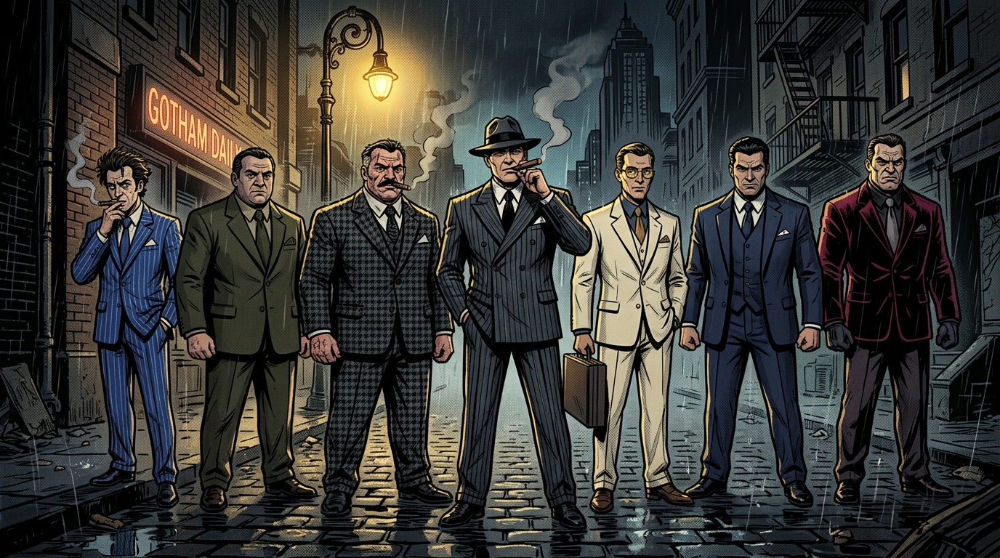
</div>

Every order in **The Syndicate Seven** (`₹ 20,20,000` total vault value) includes the **bespoke ballistic jacket**, **matching tailored trousers**, and **certified Kevlar armor core**:

<div align="center">

| # | Bespoke Cut | Archetype Portrait | Silhouette & Rank | Price (INR) | Ballistic Core | Primary Italian Fabric & Syndicate Rule |
| :-: | :---: | :---: | :--- | :---: | :---: | :--- |
| **01** | 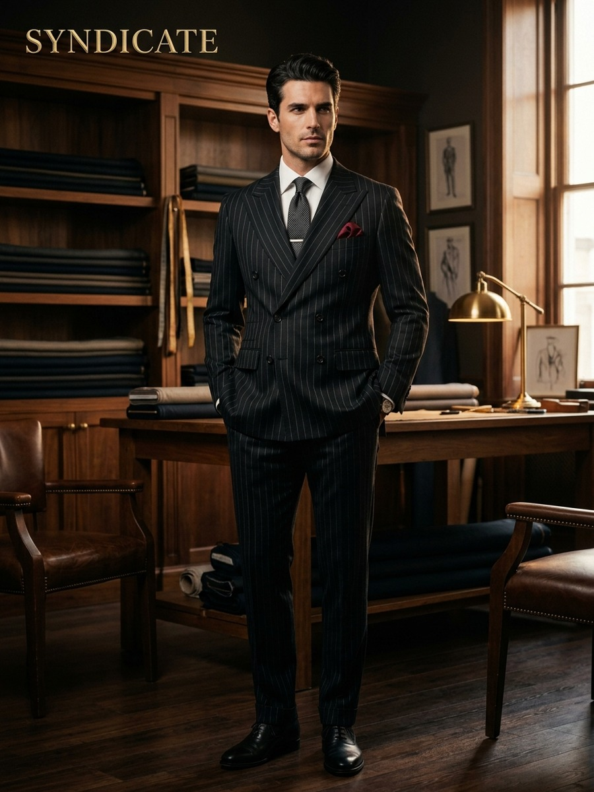 | 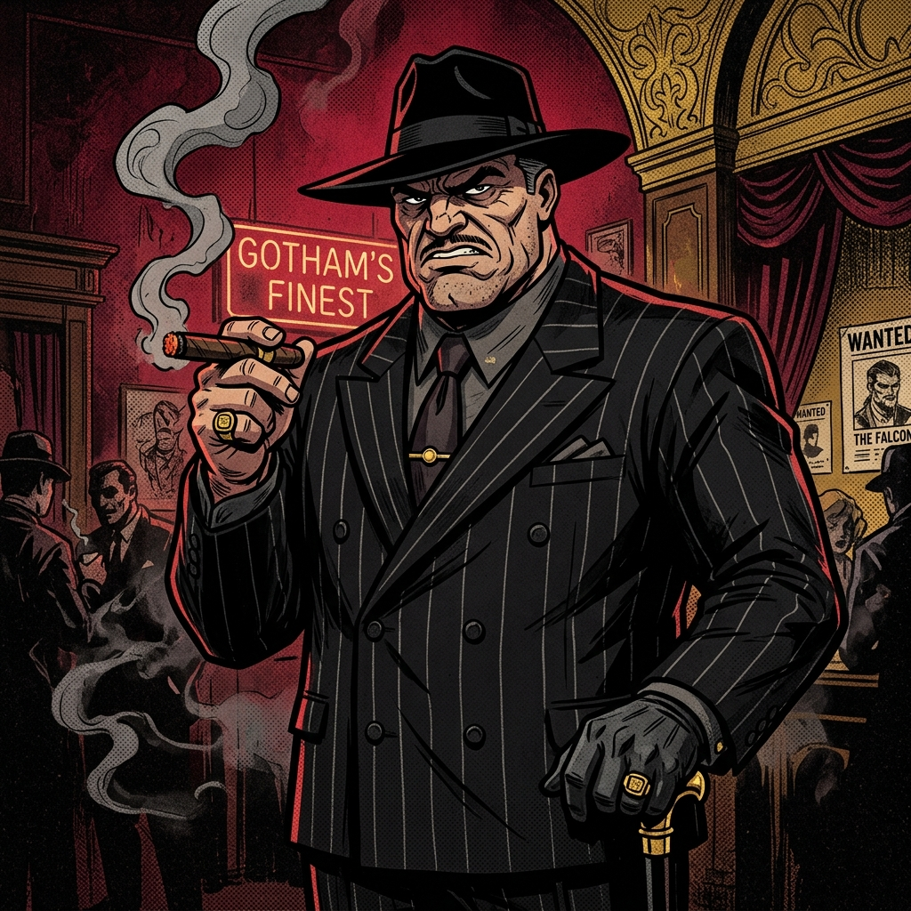 | **The Don**<br/>*Il Capo dei Capi*<br/>`Boss of Bosses` | **₹ 3,45,000** | `Level III-A` | **Onyx Midnight Super-180s Wool**<br/>*RULE #1 • NEVER RAISE YOUR VOICE* |
| **02** | 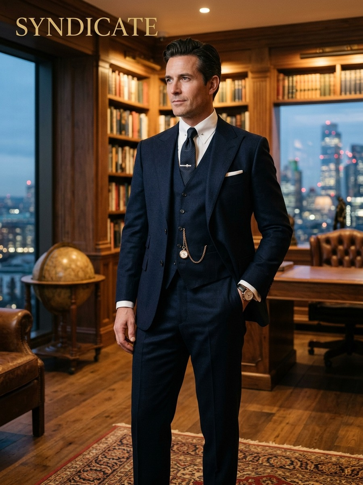 | 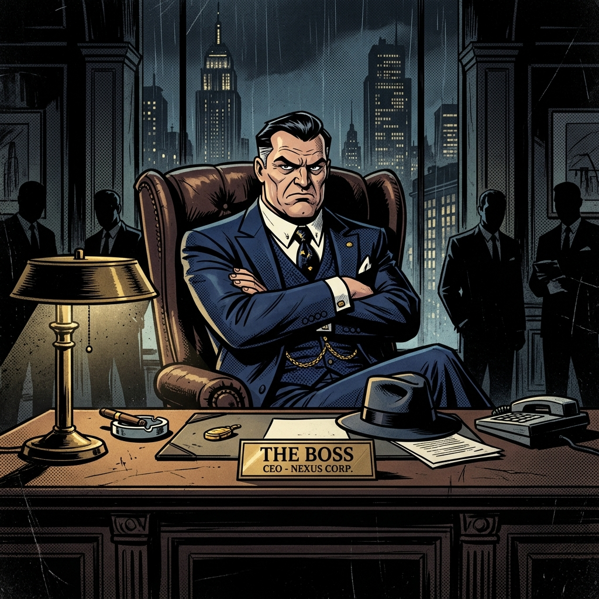 | **The Boss**<br/>*The Executive Kingpin*<br/>`Syndicate Head` | **₹ 3,10,000** | `Level II-A` | **Midnight Navy Super-180s 3-Piece**<br/>*RULE #2 • OWN THE CONTRACT, OWN THE TOWN* |
| **03** | 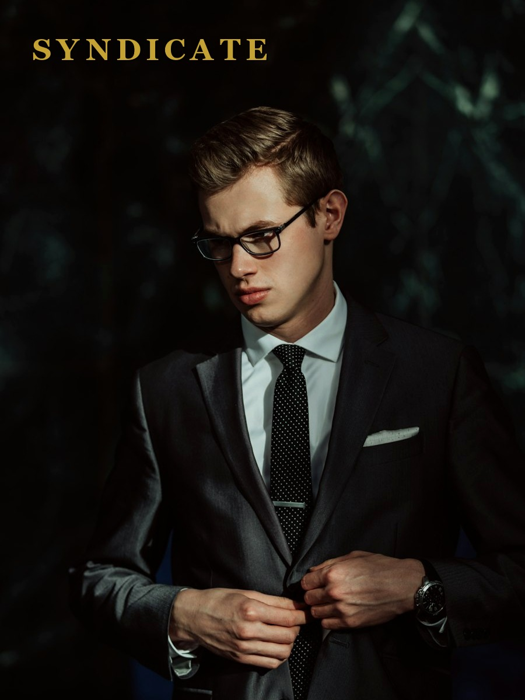 | 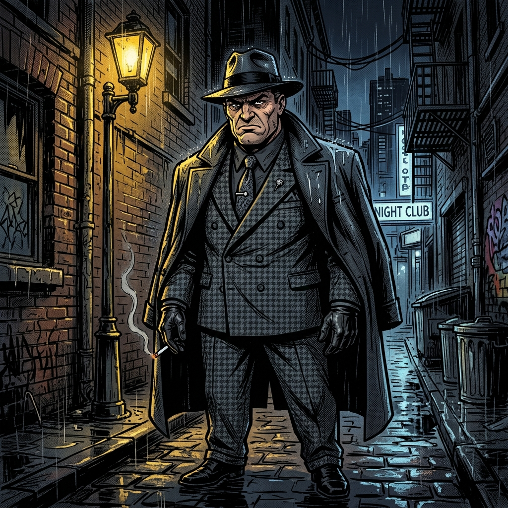 | **The Capo**<br/>*The District Commander*<br/>`Caporegime` | **₹ 2,95,000** | `Level III Tactical` | **450g Como Charcoal Worsted**<br/>*RULE #3 • PROMISES DELIVERED IN CASH & IRON* |
| **04** | 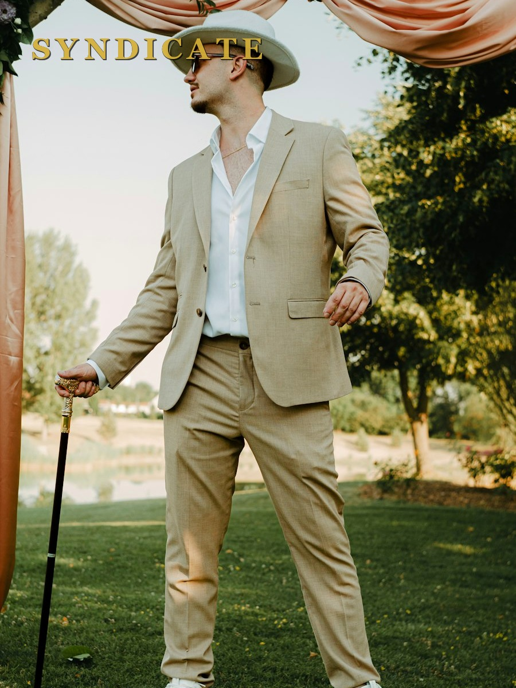 | 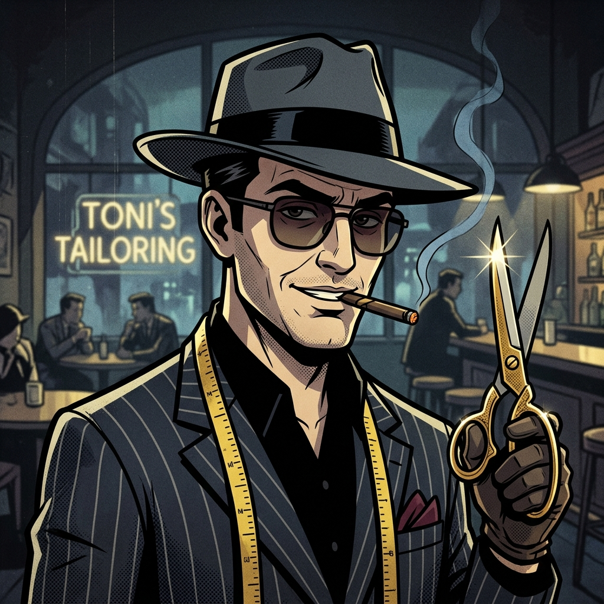 | **The Consigliere**<br/>*The Mastermind*<br/>`Legal Architect` | **₹ 2,80,000** | `Level II-A` | **Sicilian Cream Chalk-Stripe Linen**<br/>*RULE #4 • A SHARP TONGUE SILENCES TEN BULLETS* |
| **05** | 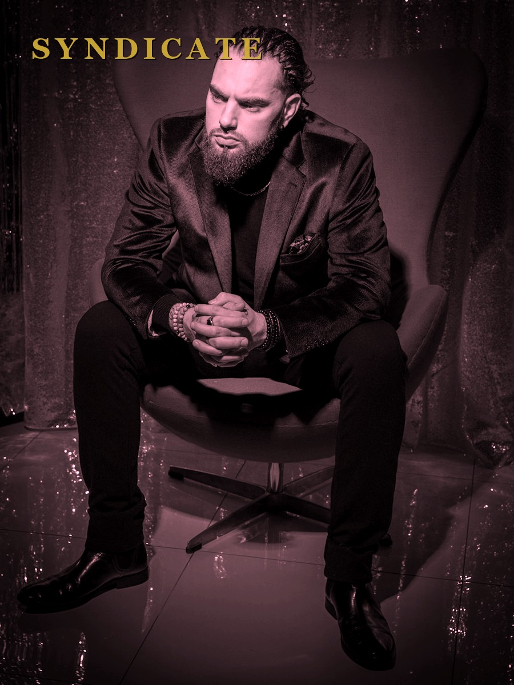 |  | **The Enforcer**<br/>*The Iron Fist*<br/>`Prime Enforcer` | **₹ 2,65,000** | `Level III Tactical` | **Royale Burgundy French Velvet**<br/>*RULE #5 • ACT WITHOUT DOUBT OR DELAY* |
| **06** | 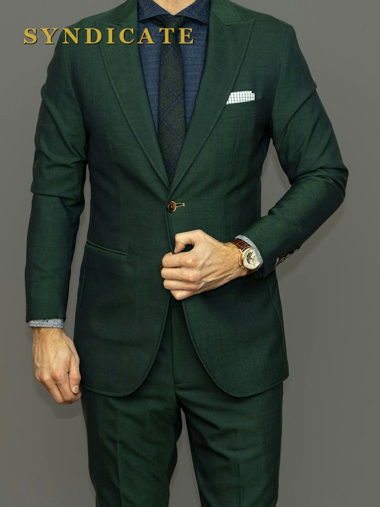 |  | **The Underboss**<br/>*The Shadow General*<br/>`Underboss` | **₹ 2,50,000** | `Level IV Stealth` | **Covert Olive Cavalry Twill**<br/>*RULE #6 • THE SHADOW STRIKES BEFORE THE LIGHT* |
| **07** | 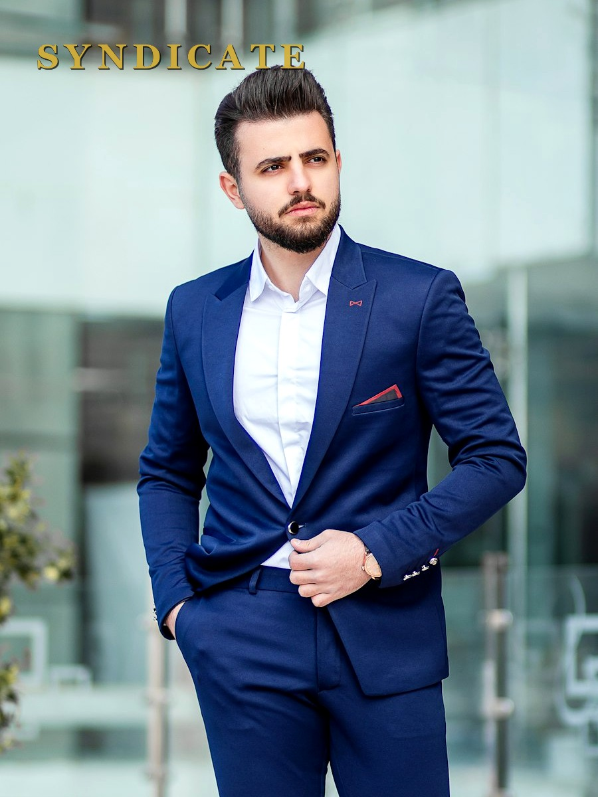 |  | **The Wildcard**<br/>*The Casino Maverick*<br/>`High Roller` | **₹ 2,75,000** | `Level II-A` | **Royal Cobalt Silver Pinstripe**<br/>*RULE #7 • ALWAYS DOUBLE DOWN ON RED* |

</div>

---

## 🏛️ The Syndicate Code — Four Pillars of Craftsmanship

<div align="center">
<table>
  <tr>
    <td align="center" width="25%">
      
      <h4>01 • THE CUT</h4>
      <sub>Architectural Roman & Neapolitan shoulders engineered to command any sit-down without uttering a word.</sub>
    </td>
    <td align="center" width="25%">
      
      <h4>02 • THE FABRIC</h4>
      <sub>Super-180s Como worsted wool, Sicilian flax linen, and French velvet laminated with micro-woven Kevlar.</sub>
    </td>
    <td align="center" width="25%">
      
      <h4>03 • THE DETAIL</h4>
      <sub>Counter-balanced shoulder holsters, titanium thread button anchors, and hidden cigar & ledger pockets.</sub>
    </td>
    <td align="center" width="25%">
      
      <h4>04 • THE ATTITUDE</h4>
      <sub>Hand-finished on Mulberry Street since 1928 for bosses who write their own rules.</sub>
    </td>
  </tr>
</table>
</div>

---

## ⚡ 13 Autonomous DOM Tools & Generative UI Cards

Toni Lee controls the entire application in real time via function calling (`lib/toni-tools.ts` & `components/avatar/generative-ui-card.tsx`):

| Tool Name | Parameters | Live Screen Action | Try Asking Toni Lee |
| :--- | :--- | :--- | :--- |
| 🛍️ `navigate_to_shop` | — | Smoothly navigates to `/shop` (The Bespoke Vault). | *"Take me to the shop, Toni."* |
| 🏠 `navigate_to_home` | — | Returns to the main atelier entrance (`/`). | *"Take me back to the front entrance."* |
| 📜 `scroll_to_section` | `sectionId` | Smooth-scrolls to `brand-story`, `syndicate-code`, `syndicate-seven`, `reviews`, or `black-ledger`. | *"Show me the Syndicate Code."* |
| 🔍 `filter_catalog` | `category`, `query` | Filters `/shop` by `double-breasted`, `three-piece`, `velvet-gala`, `tactical`, or `summer-linen`. | *"Filter for double-breasted suits."* |
| 👁️ `quick_view_suit` | `suitId` | Opens the bespoke specification modal (`SuitQuickViewModal`). | *"Inspect The Consigliere."* |
| ✂️ `customize_suit` | `suitId`, `fabricId`, `lapelId` | Navigates to `/customizer?suit=<id>` or live-swaps fabrics & lapels. | *"Let's customize The Boss in navy pinstripe."* |
| 🎯 `highlight_suit` | `suitId` | Scrolls to the suit card and pulses a crimson/gold spotlight border. | *"Highlight The Enforcer."* |
| 🃏 `recommendSuit` | `suitId`, `reason` | Renders an interactive **Generative UI Suit Card** with 1-click *Commission Suit* button in chat. | *"Recommend a suit for a casino gala."* |
| 💼 `add_to_briefcase` | `suitId`, `size` | Packs the bespoke suit into the user's Black Ledger briefcase cart. | *"Add The Don to my briefcase, size 42R."* |
| 🗑️ `remove_from_briefcase` | `suitId` | Removes a specific suit (or the most recent item) from the briefcase. | *"Remove The Don from my cart."* |
| 🧹 `clear_briefcase` | — | Purges all items from the Black Ledger briefcase cleanly. | *"Empty my briefcase, wipe the ledger clean."* |
| 📂 `open_briefcase` | — | Opens the sliding Black Ledger drawer + renders an in-chat **Briefcase Mini-Inspector**. | *"Open my briefcase."* |
| 🔒 `close_briefcase` | — | Secures and closes the Black Ledger drawer. | *"Close the briefcase."* |
| 🏷️ `apply_family_discount` | `code` | Applies a family tribute cipher, triggers gold/crimson confetti, and renders a **VIP Cipher Card**. | *"Give me a family discount code."* |

---

## 🔑 Secret Underworld Family Passcodes

Redeem these secret passcodes in **The Black Ledger** (`/briefcase`), the **VIP Cipher Bar** on the home page, or by asking **Toni Lee**:

<div align="center">

| Passcode Cipher | Tribute Discount | Clearance Level | Effect |
| :---: | :---: | :--- | :--- |
| 👑 **`DON_CORLEONE`** | **35% OFF** | *Il Capo dei Capi* | Maximum Godfather tribute + celebratory gold confetti burst |
| 🏛️ **`FIVE_FAMILIES`** | **30% OFF** | *Commission Sit-Down* | High-council syndicate tribute across all bespoke cuts |
| ✂️ **`TONI_SPECIAL`** | **25% OFF** | *Master Tailor Favor* | Toni Lee's personal Mulberry Street atelier courtesy |
| 🤝 **`GOODFELLA`** | **20% OFF** | *Made Man Courtesy* | Interactive Generative UI one-click redemption in chat |

</div>

---

## 🎨 1990s Cartoon Noir Design System

<div align="center">
  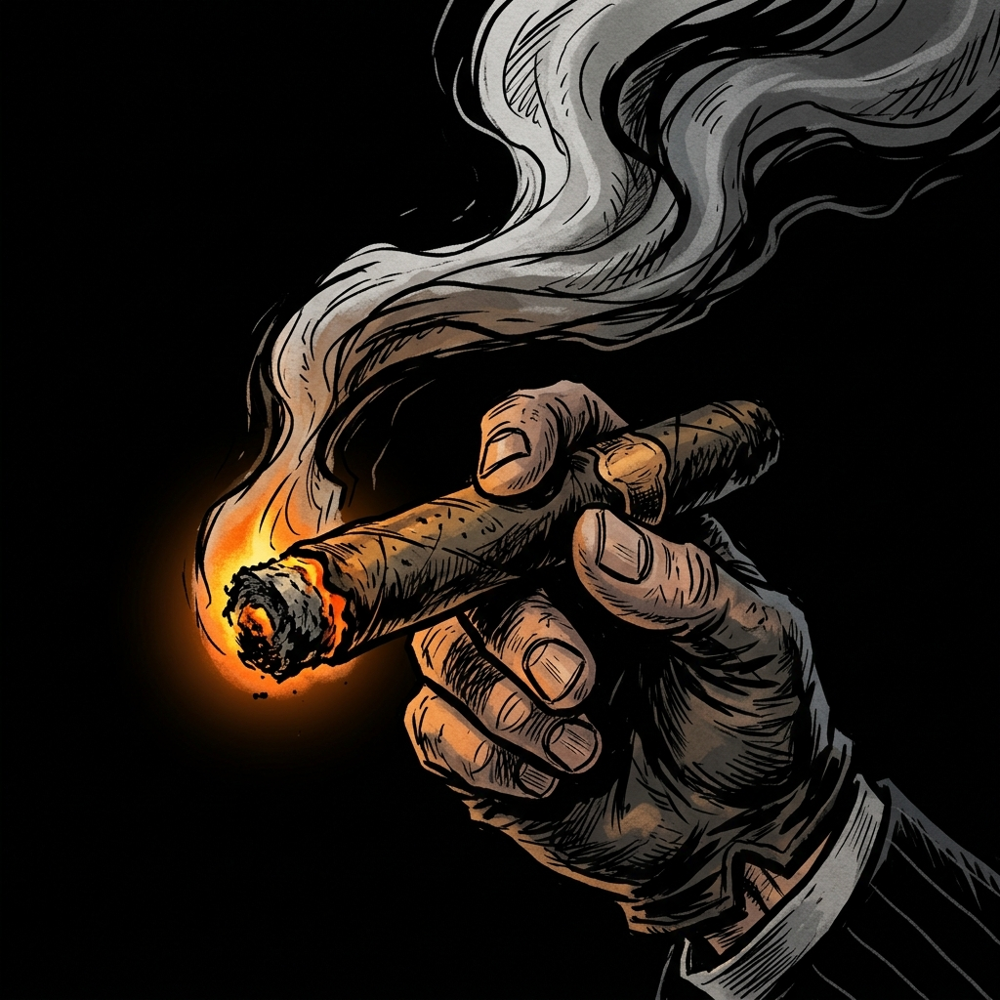
</div>

Inspired by *Batman: The Animated Series*, *Spider-Man 90s Kingpin Noir*, and *Dick Tracy*, the interface enforces a strict **Anti-Slop 1990s Comic Noir** visual language (`AGENTS.md`):

- 🎨 **Signature Palette**:
  -  **Mafia Crimson** (`#8B0000` / `#DC2626`)
  -  **Speakeasy Gold** (`#D4AF37` / `#B59454`)
  -  **Onyx Charcoal** (`#0B0B0A` / `#121214`)
  -  **Parchment Ivory** (`#E9DFC9` / `#EDE6D6`)
  -  **Midnight Navy** (`#0F172A` / `#172554`)
- 🖋️ **Borders & Shadows**: 3px bold black ink outlines (`border-3 border-black`) and hard cel-shaded drop shadows (`shadow-[5px_5px_0px_0px_rgba(0,0,0,1)]`).
- 🔤 **Typography**: *Cinzel* & *Oswald* dramatic display headers paired with *Cormorant Garamond*, *Inter*, and *JetBrains Mono* ledger numerals.

---

## 📂 Project Directory Structure

```text
Syndicate-Suits/
├── app/
│   ├── api/
│   │   ├── chat/route.ts                     # OpenRouter (NVIDIA Nemotron 3 Ultra) + Vercel AI SDK streaming route
│   │   └── tts/route.ts                      # Microsoft Edge Neural TTS (en-US-ChristopherNeural) audio stream
│   ├── briefcase/page.tsx                    # Full-screen Black Ledger Briefcase Cart & Checkout
│   ├── customizer/page.tsx                   # 3D Bespoke Tailoring Studio (/customizer?suit=<id>)
│   ├── shop/
│   │   ├── [id]/page.tsx                     # Individual Bespoke Cut Specifications & Configurator
│   │   └── page.tsx                          # The Bespoke Vault catalog with occasion & silhouette filters
│   ├── globals.css                           # 90s Cartoon Noir utilities, ink borders & halftone textures
│   ├── layout.tsx                            # Root layout with Google Fonts, nav, footer & Toni Lee widget
│   └── page.tsx                              # Landing page (40-Frame Hero, Brand Story, Code, 3D Roster, Reviews)
├── components/
│   ├── avatar/                               # Toni Lee AI Consigliere & Lip-Sync Engine
│   │   ├── generative-ui-card.tsx            # In-chat Suit Dossier, Briefcase Inspector & VIP Cipher cards
│   │   ├── syndicate-chat-card.tsx           # 90s Comic Noir chat interface & quick-action pills
│   │   ├── toni-assistant-widget.tsx         # Floating Consigliere dock & voice wave trigger
│   │   ├── toni-speech-controller.tsx        # Web Speech STT + sentence-queued Edge Neural TTS + Web Audio FFT
│   │   └── toni-video-player.tsx             # Dual-layer crossfading idle PNG / talking MP4 avatar player
│   ├── brand/                                # Heritage & Editorial Lore Sections
│   │   ├── brand-story-section.tsx           # 1928 Little Italy origin story & interactive polaroid stack
│   │   ├── syndicate-code-section.tsx        # The 4 Kraft-paper pillars of Syndicate craftsmanship
│   │   └── torn-paper-photo-frame.tsx        # Archival torn-paper photo deck
│   ├── briefcase/
│   │   └── briefcase-modal.tsx               # Slide-over Black Ledger drawer with confetti & discount engine
│   ├── catalog/                              # 3D Stages, Carousels & Product Showcases
│   │   ├── Hero.tsx                          # 40-frame canvas scrub hero with dynamic fedora watermark
│   │   ├── bespoke-consultation-banner.tsx   # Interactive Toni Lee private consultation callout
│   │   ├── character-3d-canvas.tsx           # Three.js / React Three Fiber 3D revolving card stage
│   │   ├── final-cta-section.tsx             # Mulberry St. private fitting appointment CTA
│   │   ├── shop-campaign-hero.tsx            # 1990s cartoon noir shop campaign banner
│   │   ├── suit-grid.tsx                     # Interactive suit lineup with live fabric swatch switching
│   │   ├── suit-quick-view-modal.tsx         # Comic book specification quick-view modal
│   │   ├── syndicate-ledger-newsletter.tsx   # Underworld Wire encrypted dispatch signup
│   │   ├── syndicate-reviews.tsx             # Word on the Street mobster testimonials
│   │   └── syndicate-seven-3d-carousel.tsx   # Interactive 7-Boss archetype selector & showcase
│   ├── layout/
│   │   ├── providers.tsx                     # Client providers wrapper
│   │   ├── smooth-scroll-provider.tsx        # Lenis + GSAP ScrollTrigger smooth scroll engine
│   │   ├── syndicate-footer.tsx              # Cinematic video-background footer (hero.mp4)
│   │   └── syndicate-nav.tsx                 # Atelier top navigation & live briefcase counter
│   └── ui/
│       ├── animated-cigar.tsx                # High-detail burning cigar with animated ash & ember glow
│       ├── kinetic-scroll.tsx                # Kinetic scroll skew, 3D tilt cards & word-by-word reveals
│       └── smoke-canvas.tsx                  # HTML5 Canvas volumetric speakeasy smoke particles
├── lib/
│   ├── audio-analyser.ts                     # Web Audio API FFT frequency analyzer for lip-sync
│   ├── briefcase-store.ts                    # Zustand persistent cart & discount calculation store
│   ├── characters-data.ts                    # Canonical lore & traits for the 7 Syndicate archetypes
│   ├── gemini.ts                             # Client SSE stream reader & zero-latency local fallback
│   ├── knowledge-base.ts                     # Complete Mulberry St. knowledge base & system prompt builder
│   ├── suits-data.ts                         # Canonical specs, fabrics, lapels & INR pricing for all 7 suits
│   ├── toni-store.ts                         # Zustand store for Toni Lee avatar state, mic & messages
│   ├── toni-tools.ts                         # Client DOM executor for all 13 autonomous tools
│   └── utils.ts                              # Classname merge helper
├── public/
│   ├── images/                               # Character portraits, suit cuts, torn-frames & noir artwork
│   ├── suits-video/                          # 40 sequential PNG frames (ezgif-frame-001.png - 040.png)
│   ├── videos/                               # Toni Lee idle (toni-lee-idle.png) & talking (toni-lee-talking.mp4)
│   ├── hashtag.png                           # Vintage fedora & emblem watermark
│   └── hero.mp4                              # Full-bleed atmospheric noir video
├── AGENTS.md                                 # Master architecture & 1990s Cartoon Noir specification
└── .env.example                              # OpenRouter Nemotron environment template
```

---

## 🚀 Quick Start & Vercel Deployment

### 1. Clone & Install

```bash
git clone https://github.com/Bala0o8o0/Syndicate-Suits.git
cd Syndicate-Suits
pnpm install
```

### 2. Configure Environment Variables (`.env.local`)

Copy `.env.example` to `.env.local`:

```bash
cp .env.example .env.local
```

Add your free [OpenRouter API Key](https://openrouter.ai/keys):

```env
# OpenRouter API Key (https://openrouter.ai/keys)
OPENROUTER_API_KEY=your_openrouter_api_key_here
OPENROUTER_MODEL=nvidia/nemotron-3-ultra-550b-a55b:free
```

> 💡 **Zero-Key Offline Mode**: Even if `OPENROUTER_API_KEY` is left blank, Toni Lee's built-in 27-rule local natural language synthesizer + Microsoft Edge Neural TTS works out of the box with zero configuration!

### 3. Run Locally

```bash
pnpm dev
```

Open **[http://localhost:3000](http://localhost:3000)** and click the **Toni Lee Consigliere** dock in the bottom-right corner.

### 4. Deploy Free on Vercel (Recommended)

1. Import **`Bala0o8o0/Syndicate-Suits`** at **[vercel.com/new](https://vercel.com/new)**.
2. Add the two environment variables under **Project Settings → Environment Variables**:
   - `OPENROUTER_API_KEY` = `your_openrouter_api_key_here`
   - `OPENROUTER_MODEL` = `nvidia/nemotron-3-ultra-550b-a55b:free`
3. Click **Deploy** — Vercel's Node.js serverless runtime natively runs Next.js 16, `msedge-tts` WebSockets, and OpenRouter SSE streaming.

---

<div align="center">

### 🎩 **SYNDICATE SUITS ATELIER • 444 MULBERRY ST, LITTLE ITALY • EST. 1928**
*"In this town, respect is earned—and we stitch it into every lapel. Capisce?"*

[](https://github.com/Bala0o8o0/Syndicate-Suits)

</div>
