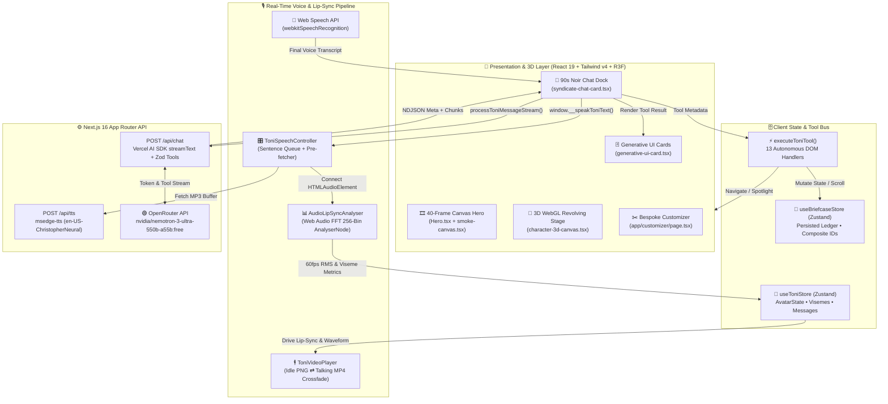
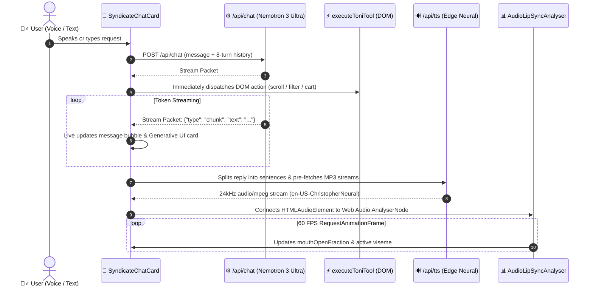

<div align="center">

<!-- Animated Typing Header -->


<p align="center">
  
  
  
  
  
</p>
<p align="center">
  
  
  
  
</p>

<br />


<br />

```text
╔══════════════════════════════════════════════════════════════════════════════════════════╗
║  "Fuggedaboutit! Look at you walking around in off-the-rack like a two-bit street punk.  ║
║   I'm Toni Lee—Master Tailor & Consigliere. Tell Toni what kind of sit-down you're       ║
║   stepping into, and I'll get you fitted in pure syndicate gold."                        ║
╚══════════════════════════════════════════════════════════════════════════════════════════╝
```

</div>

---

## 🧭 Table of Contents

- [🎯 Project Overview](#-project-overview)
- [🤖 Toni Lee — The AI Consigliere Chatbot Engine](#-toni-lee--the-ai-consigliere-chatbot-engine)
- [🏛️ Full-Stack System Architecture](#️-full-stack-system-architecture)
- [🎨 UI Design System & 1990s Cartoon Noir Engineering](#-ui-design-system--1990s-cartoon-noir-engineering)
- [🧰 Core Libraries & Technology Stack](#-core-libraries--technology-stack)
- [📂 Project Directory Structure](#-project-directory-structure)

---

## 🎯 Project Overview

**Syndicate Suits** is an AI-driven, interactive 3D luxury tailoring web experience crafted in a bold **1990s Cartoon & Comic Noir** visual style (inspired by *Batman: The Animated Series*, *Spider-Man 90s Kingpin Noir*, and *Dick Tracy*).

Rather than relying on static e-commerce forms or paid cloud video-avatar streaming credits, Syndicate Suits combines **WebGL 3D rendering**, **scroll-scrubbed HTML5 canvas sequences**, **generative in-chat UI cards**, and a **real-time voice-and-lip-sync AI agent (Toni Lee)** capable of controlling the entire DOM autonomously.

```text
   ┌───────────────────────────┐       ┌───────────────────────────┐       ┌───────────────────────────┐
   │  🎨 90s Comic Noir UI     │       │  🎙️ Bidirectional Voice   │       │  ⚡ Autonomous DOM Agent  │
   │  • 3px Ink Outlines       │  ───► │  • Web Speech STT Mic     │  ───► │  • Live Route Navigation  │
   │  • Cel-Shaded Shadows     │       │  • Edge Neural TTS Stream │       │  • 3D Suit Customization  │
   │  • 40-Frame Canvas Hero   │       │  • Web Audio FFT Lip-Sync │       │  • Generative UI Cards    │
   └───────────────────────────┘       └───────────────────────────┘       └───────────────────────────┘
```

---

## 🤖 Toni Lee — The AI Consigliere Chatbot Engine

<div align="center">
  
</div>

At the heart of the application is **Toni Lee**, a multimodal conversational agent who listens, thinks, speaks, lip-syncs, renders interactive UI components inside the chat stream, and manipulates the live interface.

### 1. 🧠 LLM Brain & Streaming Pipeline (`app/api/chat/route.ts`)
- **Primary Model**: **NVIDIA Nemotron 3 Ultra (`nvidia/nemotron-3-ultra-550b-a55b:free`)** via **OpenRouter** integrated with **Vercel AI SDK 6.0 (`streamText` & `createOpenAI`)**.
- **Real-Time NDJSON / SSE Streaming**: The server streams a metadata header packet (`{ type: "meta", toolCall }`) followed by live token chunks (`{ type: "chunk", text }`), enabling immediate DOM tool execution while tokens are still typing out.
- **Zero-Latency Local Heuristic Engine**: Built-in 27-rule natural language synthesizer with strict word-boundary matching guarantees instant, in-character responses even when offline.

### 2. 🎙️ Voice Input, Neural TTS & FFT Lip-Sync (`toni-speech-controller.tsx`)
- **Speech-to-Text (STT)**: Uses the browser's native `SpeechRecognition` / `webkitSpeechRecognition` API with live interim transcript previews and a 1.8-second silence auto-submit timer.
- **Sentence-Queued Neural TTS (`/api/tts`)**: Streams high-definition `audio/mpeg` (24kHz, 48kbps mono) from **Microsoft Edge Neural TTS** (`msedge-tts` using the `en-US-ChristopherNeural` voice at `-4Hz` pitch and `+12%` rate). Sentences are pre-fetched in parallel so consecutive sentences play with zero gap.
- **Web Audio API Lip-Sync (`lib/audio-analyser.ts`)**: Connects an `AudioContext` + `AnalyserNode` (`fftSize = 256`) directly to the TTS audio element, computing vocal frequency energy (bins `2..28`, ~170Hz–2500Hz) at 60 FPS to drive:
  - **`mouthOpenFraction`** (`0.0` to `1.0`)
  - **Viseme Classification** (`idle`, `viseme_E`, `viseme_aa`, `viseme_O`)
  - **Dual-Layer Video Crossfading** (`toni-video-player.tsx`) between idle portrait and speaking animation.

### 3. 🃏 In-Chat Generative UI Cards (`generative-ui-card.tsx`)
Instead of plain text replies, Toni Lee injects interactive React components directly inside the chat feed:
- **Bespoke Suit Dossier Card**: Displays torn-paper suit artwork, ballistic rating badge, fabric specifications, and one-click **Commission Suit** & **3D Studio** buttons.
- **Black Ledger Briefcase Inspector**: Live interactive mini-cart rendered inside the chat bubble showing current commissions and total value.
- **Family Tribute Cipher Card**: Interactive ticket widget that unlocks and applies underworld privileges in one click.

### 4. ⚡ Autonomous DOM Tool Calling (`lib/toni-tools.ts`)
Toni Lee executes client-side actions directly against the Next.js router, Zustand stores, and Lenis scroll engine:

| Tool Category | Executed Functions | DOM / State Effect |
| :--- | :--- | :--- |
| **🧭 Navigation & Scroll** | `navigate_to_shop`, `navigate_to_home`, `scroll_to_section` | Triggers smooth Lenis scrolling (`window.__lenis.scrollTo`) or Next.js route transitions with automatic post-navigation target lookup. |
| **🔍 Catalog & Spotlight** | `filter_catalog`, `highlight_suit`, `quick_view_suit` | Dispatches custom `syndicate:filter` and `syndicate:quickview` DOM events and pulses a crimson/gold comic spotlight ring on target cards. |
| **✂️ 3D Customizer** | `customize_suit`, `recommendSuit` | Deep-links to `/customizer?suit=<id>`, updates active fabric/lapel swatches, and renders Generative UI dossier cards. |
| **💼 Briefcase State** | `add_to_briefcase`, `remove_from_briefcase`, `clear_briefcase`, `open_briefcase`, `close_briefcase` | Mutates the persistent `useBriefcaseStore` Zustand ledger and controls the slide-over drawer. |

---

## 🏛️ Full-Stack System Architecture

### High-Level Component & Data Flow



### Real-Time Voice-to-Action Sequence



---

## 🎨 UI Design System & 1990s Cartoon Noir Engineering

<div align="center">
  
</div>

### 1. Color Architecture & Comic Ink Tokens (`app/globals.css`)

| Swatch | Token Name | Hex Code | Usage Across the Atelier |
| :---: | :--- | :---: | :--- |
|  | **Mafia Crimson** | `#8B0000` / `#DC2626` | Primary action badges, wax stamps, comic burst callouts, alert borders |
|  | **Speakeasy Gold** | `#D4AF37` / `#B59454` | Luxury typography highlights, voice equalizer bars, brass borders |
|  | **Onyx Charcoal** | `#0B0B0A` / `#121214` | Deep speakeasy canvas backgrounds, 3px comic ink outlines |
|  | **Parchment Ivory** | `#E9DFC9` / `#EDE6D6` | Editorial headlines, archival case file cards, torn-paper frames |
|  | **Midnight Navy** | `#0F172A` / `#172554` | Executive syndicate cards, secondary dark surfaces |

### 2. Custom Visual & Motion Systems

<div align="center">
<table>
  <tr>
    <td align="center" width="25%">
      
      <h4>🎞️ 40-Frame Canvas Hero</h4>
      <sub>Scroll-driven HTML5 <code>&lt;canvas&gt;</code> frame renderer (<code>Hero.tsx</code>) with dynamic DPI scaling and fedora watermark parallax.</sub>
    </td>
    <td align="center" width="25%">
      
      <h4>🎠 3D WebGL Carousel</h4>
      <sub>Three.js / React Three Fiber 3D cylindrical card stage (<code>character-3d-canvas.tsx</code>) with damped pointer inertia.</sub>
    </td>
    <td align="center" width="25%">
      
      <h4>⚡ Kinetic Scroll Physics</h4>
      <sub>Velocity-linked skew wrappers, spring-damped 3D tilt cards, magnetic buttons, and word-by-word reveals (<code>kinetic-scroll.tsx</code>).</sub>
    </td>
    <td align="center" width="25%">
      
      <h4>🚬 Speakeasy Smoke</h4>
      <sub>Procedural HTML5 Canvas particle engine (<code>smoke-canvas.tsx</code>) & animated burning cigar ember system (<code>animated-cigar.tsx</code>).</sub>
    </td>
  </tr>
</table>
</div>

### 3. Typography Hierarchy (`app/layout.tsx`)
- **Display & Noir Headers**: **Cinzel** (`500–900`) & **Oswald** (`500–700`) for dramatic Art-Deco and 1990s graphic novel headlines.
- **Editorial Serif**: **Cormorant Garamond** (roman & italic) for vintage tailoring lore and quotes.
- **UI & Ledger Numerals**: **Inter** for clean body copy and **JetBrains Mono** for tabular ledger codes and specification metrics.

---

## 🧰 Core Libraries & Technology Stack

```text
┌──────────────────────────────────────────────────────────────────────────────────────────┐
│                              🛠️  SYNDICATE TECH STACK                                    │
├──────────────────────┬───────────────────────────────────┬───────────────────────────────┤
│ Layer                │ Package / Technology              │ Purpose in Project            │
├──────────────────────┼───────────────────────────────────┼───────────────────────────────┤
│ Core Framework       │ next@16.2.11, react@19.2.8        │ App Router, RSC & API Streams │
│ Type System          │ typescript@5.9.3, zod@4.3.6       │ Strict typing & tool schemas  │
│ Styling & CSS        │ tailwindcss@4.3.2, clsx           │ 90s Comic Noir design tokens  │
│ 3D & WebGL           │ three@0.185, @react-three/fiber   │ 3D revolving character stage  │
│ 3D Helpers           │ @react-three/drei@10.7.7          │ WebGL textures, environment   │
│ Scroll & Motion      │ gsap@3.15, lenis@1.3, framer      │ Smooth scroll & kinetic tilt  │
│ AI Orchestration     │ ai@6.0, @ai-sdk/openai@3.0        │ OpenRouter Nemotron streaming │
│ Neural Voice TTS     │ msedge-tts@2.0.6                  │ Free neural mobster synthesis │
│ Audio Lip-Sync       │ Web Audio API (AnalyserNode)      │ Real-time FFT mouth/visemes   │
│ State Management     │ zustand@5.0.14                    │ Avatar & persistent cart state│
│ Visual Effects       │ canvas-confetti, lucide-react     │ Celebrations & noir iconography│
└──────────────────────┴───────────────────────────────────┴───────────────────────────────┘
```

---

## 📂 Project Directory Structure

```text
Syndicate-Suits/
├── app/
│   ├── api/
│   │   ├── chat/route.ts                     # OpenRouter (NVIDIA Nemotron 3 Ultra) + Vercel AI SDK streaming route
│   │   └── tts/route.ts                      # Microsoft Edge Neural TTS (en-US-ChristopherNeural) audio endpoint
│   ├── briefcase/page.tsx                    # Full-screen Black Ledger Briefcase Cart & Checkout view
│   ├── customizer/page.tsx                   # Interactive 3D Bespoke Tailoring Studio
│   ├── shop/
│   │   ├── [id]/page.tsx                     # Dynamic Bespoke Cut Specification & Configurator page
│   │   └── page.tsx                          # The Bespoke Vault catalog with live silhouette filters
│   ├── globals.css                           # 90s Cartoon Noir theme tokens, ink borders & halftone utilities
│   ├── layout.tsx                            # Root layout with Google Fonts, smooth scroll & Toni Lee dock
│   └── page.tsx                              # Atelier landing page (Canvas Hero, Story, Code, 3D Roster, Reviews)
├── components/
│   ├── avatar/                               # 🤖 Toni Lee AI Consigliere & Audio Lip-Sync Engine
│   │   ├── generative-ui-card.tsx            # In-chat Suit Dossier, Briefcase Inspector & Tribute cards
│   │   ├── syndicate-chat-card.tsx           # 90s Comic Noir chat interface, quick pills & streaming reader
│   │   ├── toni-assistant-widget.tsx         # Floating Consigliere dock & voice wave trigger
│   │   ├── toni-speech-controller.tsx        # Web Speech STT + sentence-queued Edge Neural TTS + Web Audio FFT
│   │   └── toni-video-player.tsx             # Dual-layer crossfading idle/speaking avatar video player
│   ├── brand/                                # 🏛️ Editorial Lore & Torn-Paper Archival Components
│   │   ├── brand-story-section.tsx           # 1928 Little Italy chronicle & interactive photo stack
│   │   ├── syndicate-code-section.tsx        # Four Kraft-paper pillars with custom tailoring artwork
│   │   └── torn-paper-photo-frame.tsx        # SVG clip-path torn-paper photo deck
│   ├── briefcase/
│   │   └── briefcase-modal.tsx               # Slide-over Black Ledger drawer
│   ├── catalog/                              # 🎠 3D Stages, Canvas Hero & Showcase Components
│   │   ├── Hero.tsx                          # 40-frame scroll-scrubbed HTML5 canvas hero
│   │   ├── bespoke-consultation-banner.tsx   # Interactive Toni Lee consultation banner
│   │   ├── character-3d-canvas.tsx           # Three.js / React Three Fiber 3D revolving card stage
│   │   ├── final-cta-section.tsx             # Mulberry St. appointment booking section
│   │   ├── shop-campaign-hero.tsx            # 1990s cartoon noir shop campaign header
│   │   ├── suit-grid.tsx                     # Interactive suit lineup with live fabric swatch switching
│   │   ├── suit-quick-view-modal.tsx         # Comic book specification quick-view modal
│   │   ├── syndicate-ledger-newsletter.tsx   # Underworld Wire dispatch signup
│   │   ├── syndicate-reviews.tsx             # Client testimonials carousel
│   │   └── syndicate-seven-3d-carousel.tsx   # Interactive archetype selector & 3D showcase
│   ├── layout/
│   │   ├── providers.tsx                     # Application context providers
│   │   ├── smooth-scroll-provider.tsx        # Lenis + GSAP ScrollTrigger smooth scroll integration
│   │   ├── syndicate-footer.tsx              # Cinematic video-background footer
│   │   └── syndicate-nav.tsx                 # Top atelier navigation bar & live briefcase badge
│   └── ui/
│       ├── animated-cigar.tsx                # Burning cigar artwork with animated ember glow & rising smoke
│       ├── kinetic-scroll.tsx                # Velocity skew wrapper, 3D tilt card & magnetic button primitives
│       └── smoke-canvas.tsx                  # HTML5 Canvas volumetric speakeasy smoke particle system
├── lib/
│   ├── audio-analyser.ts                     # Web Audio API FFT frequency analyzer for real-time lip-sync
│   ├── briefcase-store.ts                    # Zustand persistent cart state
│   ├── characters-data.ts                    # Archetype lore & visual metadata
│   ├── gemini.ts                             # Client NDJSON stream reader & local fallback engine
│   ├── knowledge-base.ts                     # System prompt builder & tailoring knowledge base
│   ├── suits-data.ts                         # Suit fabrics, lapels, linings & configuration metadata
│   ├── toni-store.ts                         # Zustand store for Toni Lee avatar state, mic & chat history
│   ├── toni-tools.ts                         # Client DOM executor for all 13 autonomous tools
│   └── utils.ts                              # Tailwind class merging utility
├── public/
│   ├── images/                               # 90s Comic Noir artwork, character portraits & torn-frame assets
│   ├── suits-video/                          # 40 sequential PNG frames for the scroll-scrubbed canvas hero
│   ├── videos/                               # Toni Lee idle & talking avatar media
│   ├── hashtag.png                           # Vintage fedora & emblem watermark
│   └── hero.mp4                              # Atmospheric noir background video
└── AGENTS.md                                 # Master architecture & 1990s Cartoon Noir specification
```

---

<div align="center">

```text
━━━━━━━━━━━━━━━━━━━━━━━━━━━━━━━━━━━━━━━━━━━━━━━━━━━━━━━━━━━━━━━━━━━━━━━━━━━━━━━━━━━━━━━━━━━━
     🎩  S Y N D I C A T E   S U I T S   •   4 4 4   M U L B E R R Y   S T R E E T
                    "Look the part, boss. Nobody asks questions."
━━━━━━━━━━━━━━━━━━━━━━━━━━━━━━━━━━━━━━━━━━━━━━━━━━━━━━━━━━━━━━━━━━━━━━━━━━━━━━━━━━━━━━━━━━━━
```

</div>
